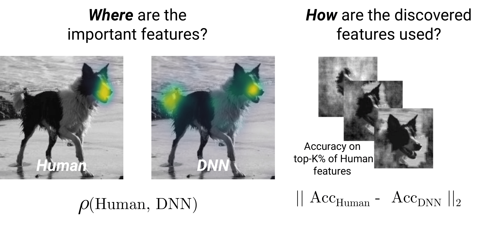
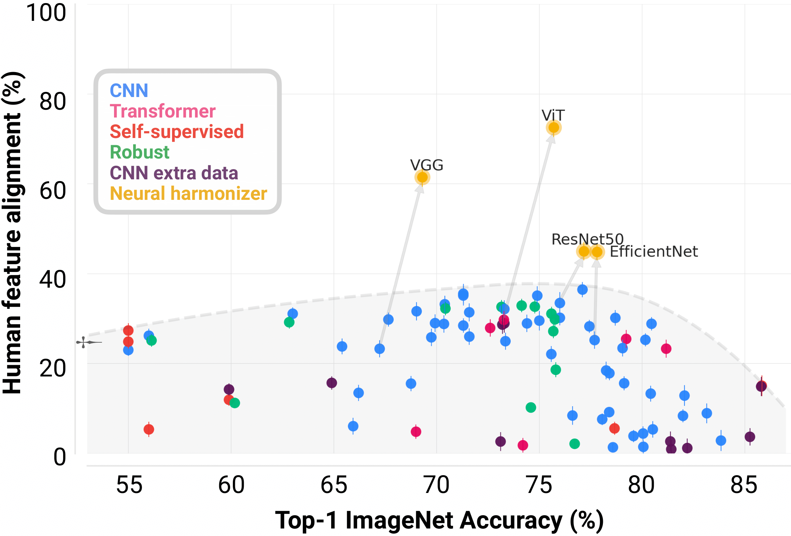

<div style="text-align:center" class="latex-font">
    <h1 style="text-align: center; font-weight: bold; color: inherit; margin-bottom: 0.2em"> Harmonizing the object recognition strategies of deep neural networks with humans </h1>

    <span class="author" style="font-weight: bold"> Thomas Fel*, Ivan Felipe Rodriguez*, Drew Linsley*, <br> Thomas Serre </span> <br>
    <span class="affiliations"> Carney Institute for Brain Science, Brown University, Providence, RI 02912 </span> <br>
    <span class="mono"> {thomas_fel,ivan_felipe_rodriguez,drew_linsley,thomas_serre}@brown.edu </span>
</div>

<p align="center">
  <a href="https://arxiv.org/abs/2211.04533"><strong>Read the official paper »</strong></a>
  <br>
  <br>
  <a href="https://serre-lab.github.io/Harmonization/results">Explore results</a>
  ·
  <a href="https://github.com/serre-lab/Harmonization">Github</a>
  ·
  <a href="https://serre-lab.github.io/Harmonization/models/">Models zoo</a>
  ·
  <a href="https://serre-lab.github.io/Harmonization/evaluation">Tutorials</a>
  ·
  <a href="https://arxiv.org/abs/1805.08819">Click-me paper</a>
</p>

<div>
    <a href="#">
        
    </a>
    <a href="https://github.com/serre-lab/Harmonization/actions/workflows/python-lint.yml">
        
    </a>
    <a href="https://github.com/serre-lab/Harmonization/actions/workflows/python-tests.yml">
        
    </a>
    <a href="https://github.com/serre-lab/Harmonization/actions/workflows/python-pip.yml">
        
    </a>
    <a href="https://pepy.tech/project/harmonization">
        
    </a>
    <a href="#">
        
    </a>
</div>


## Paper summary



The many successes of deep neural networks (DNNs) over the past decade have largely been driven by computational scale rather than insights from biological intelligence. Here, we explore if these trends have also carried concomitant improvements in explaining visual strategies underlying human object recognition. We do this by comparing two related but distinct properties of visual strategies in humans and DNNs: _where_ they believe important visual features are in images and _how_ they use those features to categorize objects. Across 85 different DNNs and three independent datasets measuring human visual strategies on ImageNet, we find a trade-off between DNN top-1 categorization accuracy and their alignment with humans. _State-of-the-art_ DNNs are progressively becoming _less aligned_ with humans. We rectify this growing issue by introducing the harmonization procedure: a general-purpose training routine that aligns DNN and human visual strategies while improving object classification performance.

### Aligning the Gradients


Human and DNNs rely on different features to recognize objects. In contrast, our neural
harmonizer aligns DNN feature importance with humans. Gradients are smoothed from both humans
and DNNs with a Gaussian kernel to improve visualization.

### Breaking the trade-off between performance and alignment



The trade-off between DNN performance and alignment with human feature importance from the _ClickMe_ dataset. Human feature alignment is the mean Spearman correlation between human and DNN feature importance maps, normalized by the average inter-rater alignment of humans. The grey-shaded region illustrates the convex hull of the trade-off between ImageNet accuracy and human feature alignment. All the models trained with the harmonization procedure are more accurate and aligned than versions of those models trained only for classification. Arrows denote a shift in performance after training with the harmonization procedure.


## Authors

<p align="center">

<div class="authors-container">

  <div class="author-block">
    
    <a href="mailto:thomas_fel@brown.edu"> Thomas Fel* </a>
  </div>


  <div class="author-block">
    
    <a href="mailto:ivan_felipe_rodriguez@brown.edu"> Ivan Felipe Rodriguez* </a>
  </div>


  <div class="author-block">
    
    <a href="mailto:drew_linsley@brown.edu"> Drew Linsley* </a>
  </div>

  <div class="author-block">
    
    <a href="mailto:thomas_serre@brown.edu"> Thomas Serre </a>
  </div>

</div>

<br>
<p align="right"> 
<i> * : all authors have contributed equally. </i>
</p>

</p>


## 🗞️ Citation

If you use or build on our work as part of your workflow in a scientific publication, please consider citing the [official paper](https://arxiv.org/abs/2211.04533):

```
@article{fel2022aligning,
  title={Harmonizing the object recognition strategies of deep neural networks with humans},
  author={Fel, Thomas and Felipe, Ivan and Linsley, Drew and Serre, Thomas},
  journal={Advances in Neural Information Processing Systems (NeurIPS)},
  year={2022}
}
```

Moreover, this paper relies heavily on previous work from the Lab, notably [Learning What and Where to Attend](https://arxiv.org/abs/1805.08819) where the ambitious ClickMe dataset was collected.

```
@article{linsley2018learning,
  title={Learning what and where to attend},
  author={Linsley, Drew and Shiebler, Dan and Eberhardt, Sven and Serre, Thomas},
  journal={International Conference on Learning Representations (ICLR)},
  year={2019}
}
```

## Tutorials

**Evaluate your own model (pytorch and tensorflow)**

[](https://colab.research.google.com/drive/1Mp0vxUcIsX1QY-_Byo1LU2IRVcqu7gUl) 


[](https://colab.research.google.com/drive/1bttp-hVnV_agJGhwdRRW6yUBbf-eImRN) 


## 📝 License

The package is released under <a href="https://choosealicense.com/licenses/mit"> MIT license</a>.